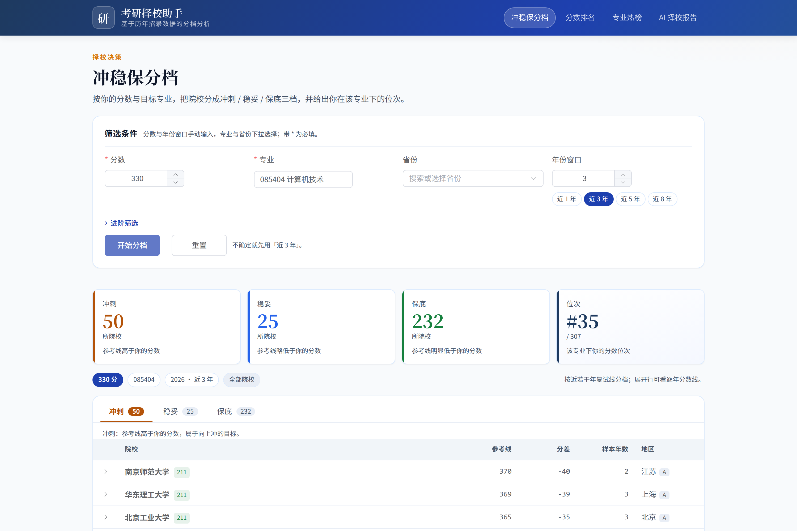
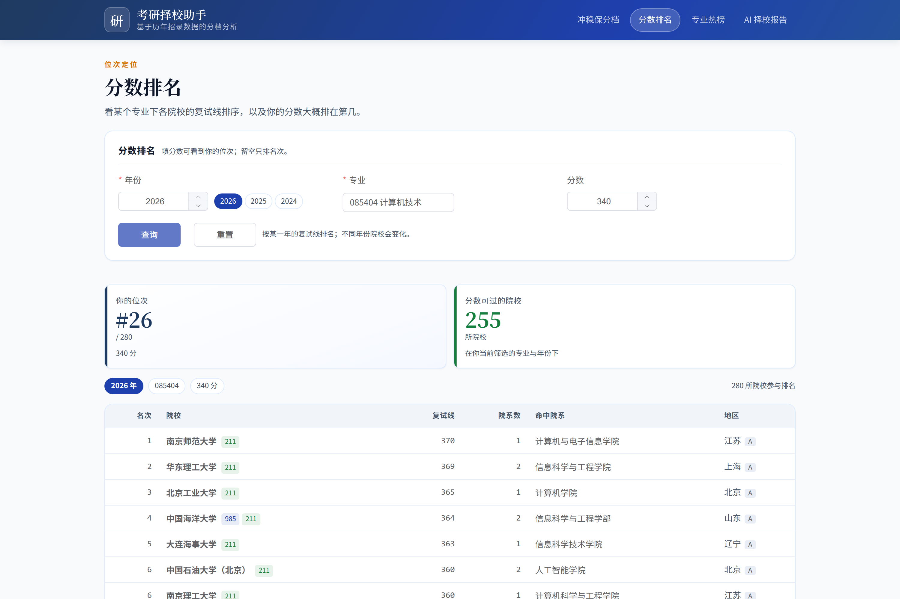
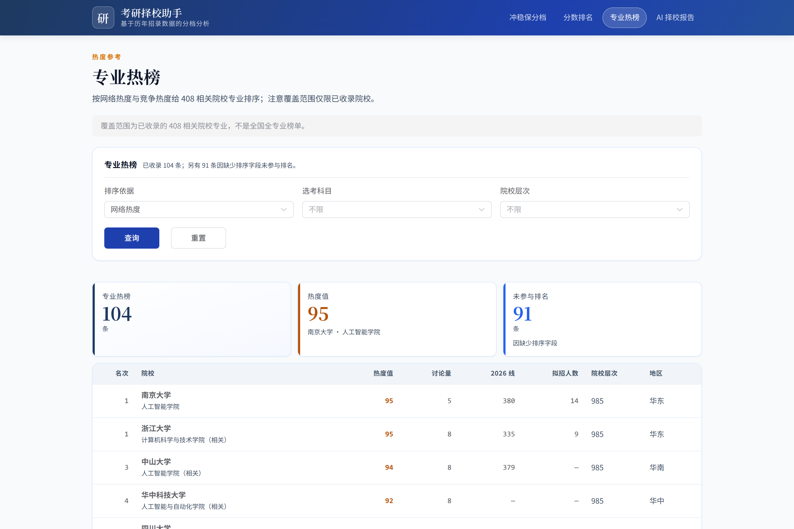
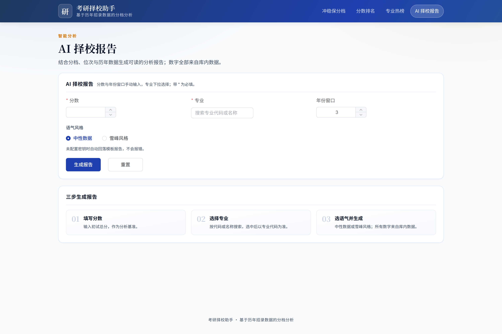

# 考研择校 + 考公路径规划智能系统

基于历年招录公开数据，提供**考研择校**与**考公路径规划**的查询与分析能力：
查院校 / 择校筛选（冲稳保）/ 分数排名 / 专业热榜 / AI 择校报告。

> 本项目把招生数据整理成可查询、可排序、可对比的形式，帮助考生在报考前
> 看清「这个专业、这个学校、这个分段，历史上是什么水平」。
> **所有结论都是对公开数据的整理与呈现，不构成官方口径或报考承诺。**

## 仓库范围

本仓库是项目的**公开镜像**，只包含两条可独立运行的产品线：

- `backend/` — FastAPI + SQLAlchemy 数据服务与 ETL
- `frontend/` — Vue 3 + Element Plus 单页应用

工程规范、设计文档、原始数据与内部协作资产位于私有仓库，不在此镜像中。

## 功能

| 页面 | 路由 | 说明 |
| --- | --- | --- |
| 冲稳保分档 | `/reach-match-safety` | 按分数与目标专业，把院校分成冲刺 / 稳妥 / 保底三档 |
| 分数排名 | `/ranking` | 按分数查看某专业 / 院校的历年位次 |
| 专业热榜 | `/heat` | 专业热度、报录比等多维排序 |
| AI 择校报告 | `/ai-report` | 基于库内数据生成择校分析报告（可接 LLM，也可模板降级） |

后端暴露 13 个 REST 端点，OpenAPI 文档随仓库提交在 `backend/openapi.json`。

## 界面预览

### 冲稳保分档

按分数把院校分成冲刺 / 稳妥 / 保底三档，并给出你在该专业下的位次：



### 分数排名

看某个专业下各院校的复试线排序，以及你的分数大概排在第几：



### 专业热榜

按网络热度与竞争热度给 408 相关院校专业排序（覆盖范围仅限已收录院校）：



### AI 择校报告

结合分档、位次与历年数据生成可读的分析报告，未配置密钥时自动回落为模板报告：



## 技术栈

- **后端**：Python 3.12+、FastAPI、SQLAlchemy 2、Pydantic v2、python-calamine（读写 Excel）
- **数据库**：默认 SQLite（`backend/exam.db`），可通过 `EXAM_DATABASE_URL` 切到 PostgreSQL
- **前端**：Vue 3、TypeScript、Vite、Vue Router、Element Plus、Vitest
- **契约**：后端导出 OpenAPI，前端据此生成 TS 类型（`npm run types:generate`）

## 快速开始

### 后端

```bash
cd backend
uv sync                       # 或: python -m venv .venv && pip install -e .
gunzip -c data/exam.db.gz > exam.db   # 展开随仓库分发的数据（约 46 MB 压缩 / 337 MB 展开）
cp ../.env.example ../.env     # 按需填写数据库与 LLM 配置（可留空）
uv run uvicorn app.main:app --reload
```

服务默认在 `http://localhost:8000`，交互式文档 `/docs`。

### 前端

```bash
cd frontend
npm install
npm run dev                 # http://localhost:5173，/api 代理到 :8000
```

### 验证

```bash
cd backend && uv run pytest
cd frontend && npm run check   # 类型生成 + 类型检查 + 单元测试
```

## 配置

配置只走**环境变量**；本地开发可放在仓库根的 `.env`（已 gitignore）。
真实环境变量优先，不会被文件覆盖。

| 变量 | 默认 | 作用 |
| --- | --- | --- |
| `EXAM_DATABASE_URL` | `sqlite:///./exam.db` | 数据库连接串 |
| `EXAM_ENV_FILE` | 仓库根 `.env` | 指定另一个 env 文件 |
| `ANTHROPIC_API_KEY` / `ANTHROPIC_MODEL` / `ANTHROPIC_BASE_URL` | 无 | 启用 Anthropic 提供者 |
| `OPENAI_API_KEY` / `OPENAI_MODEL` / `OPENAI_BASE_URL` | 无 | 启用 OpenAI 兼容提供者（DeepSeek、通义等） |

未配置任何 LLM 密钥时，AI 报告会**降级为模板报告**并在界面标注，而不是报错。

## 数据

仓库自带一份**可直接查询的 SQLite 数据库** `backend/data/exam.db.gz`（约 46 MB 压缩 / 337 MB 展开）：

| 表 | 行数 | 说明 |
| --- | --- | --- |
| `kaoyan_admission_line` | 221,706 | 2017–2026 各院校专业复试线 |
| `kaoyan_enrollment_plan` | 627,417 | 历年招生计划（招生人数、考试科目等） |
| `kaoyan_national_line` | 250 | 国家线（含 A/B 区与专项） |
| `kaoyan_cs408_unit` | 195 | 408 院校专业热度与考情 |
| `kaoyan_cs408_year_line` / `subject_change` / `conflict` | 426 / 76 / 31 | 408 逐年分数线、改考与口径冲突 |

展开后即可离线使用全部页面与接口：

```bash
cd backend && gunzip -c data/exam.db.gz > exam.db
```

数据来自高校公示与招生简章，**已做脱敏**：不含考生名单；招生计划中会夹带导师
姓名的两个自由文本列（`direction`、`enrollment_note`）在公开副本中置空，其余
可查询的分数线、招生人数等统计口径保持不变。

若要重新导入原始文件，`backend/etl/` 下的适配器仍可用（需自备原始数据），
缺少数据时相关接口返回空结果，单元测试会跳过依赖外部文件的用例。

408 相关的第三方整理数据来自 [Laz8Noy/kaoyan408-share](https://github.com/Laz8Noy/kaoyan408-share)
（CC BY 4.0），本仓库仅保留其解析与查询逻辑与已脱敏的派生结果。

## 免责声明

- 数据来自高校公示、招生简章与第三方公开整理，**可能存在出入**；
- 分数线、招生人数等以**招生单位官方发布**为准；
- 本项目不含任何个人录取名单或导师个人信息，已做脱敏处理；
- 本仓库代码仅供参考学习，使用数据请遵守原始来源的许可与条款。

## 许可证

本仓库代码以 [MIT License](LICENSE) 发布。

第三方数据（如 408 院校整理数据）不属于本项目代码，遵循其原始许可
（CC BY 4.0）；使用与转载请遵守对应来源的要求。
